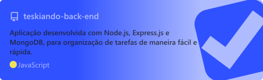
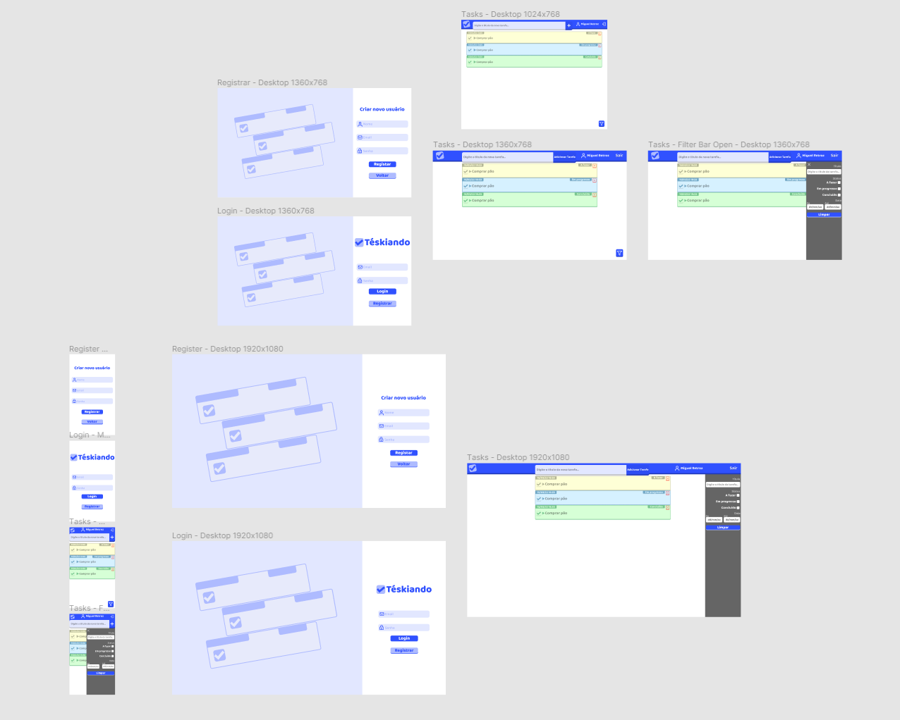
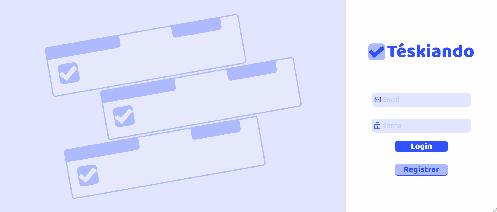
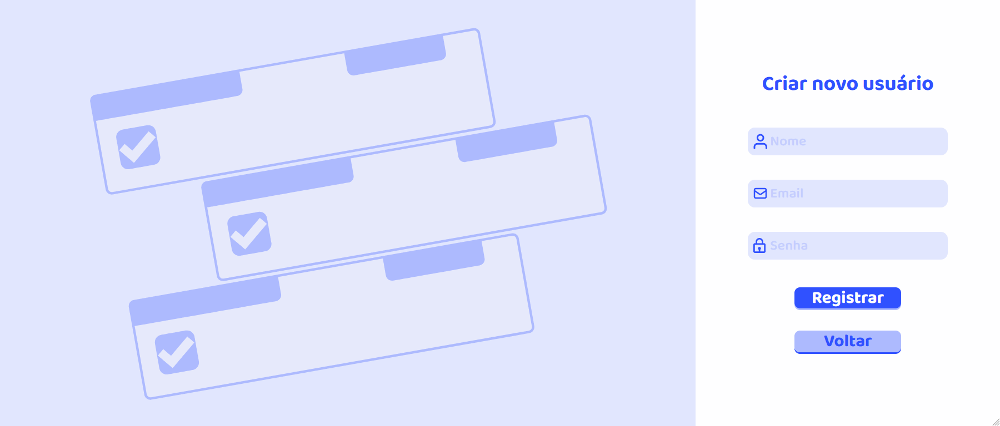
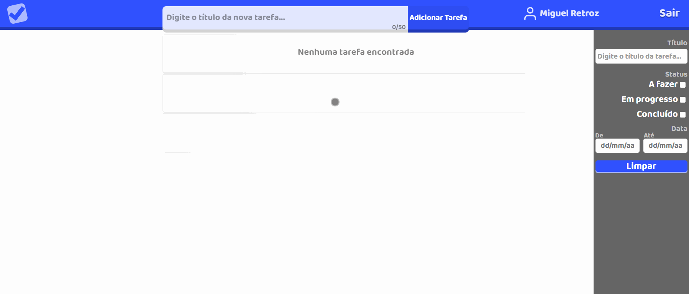
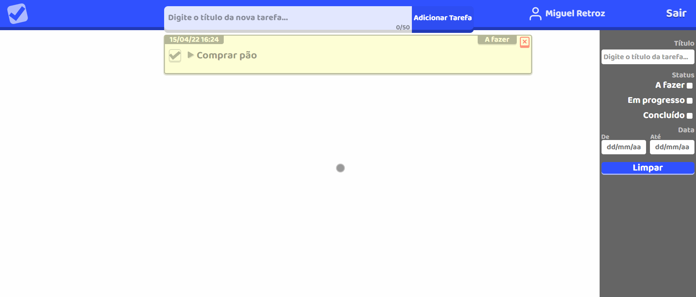
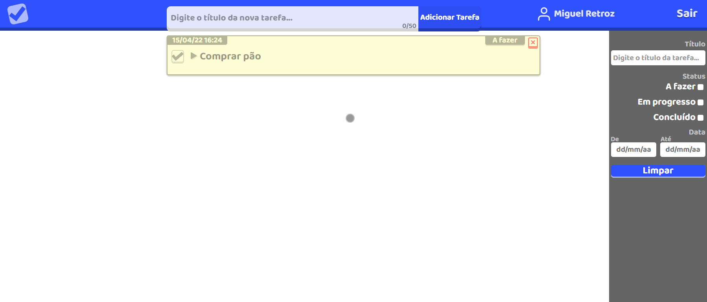

# <a href="#-téskiando-front-end"></a> Téskiando Front-end

Aplicativo para organização de tarefas, com foco em ajudar usuários a gerenciar suas tarefas de maneira fácil e rápida.

As tasks (tarefas) são organizadas baseadas em status (estado), que permitem ao usuário gerenciar a prioridade e identificar quais estão em "A fazer", "Em progresso" ou "Concluído".

Este é o repositório do código de front-end do projeto, que contém a toda interface do aplicativo.

> Através do card abaixo é possível acessar o repositório do código de back-end do projeto.

<a href="https://github.com/miguelretroz/teskiando-back-end">
  
</a>

## 🛠️ Construído com

🔹<a href="https://developer.mozilla.org/en-US/docs/Web/JavaScript">
  
    - JavaScript
</a>

🔹<a href="https://reactjs.org/">
    
     - React
  </a>

🔹<a href="https://developer.mozilla.org/en-US/docs/Web/CSS">
  
    - CSS
</a>

🔹<a href="https://styled-components.com/">
    
    - Styled Components
</a>

🔹<a href="https://airbnb.io/lottie/#/">
    
    - Lottie
</a>

## <a href="#-layout"></a> Layout

O layout da aplicação foi desenvolvindo utilizando <a href="https://www.figma.com/">Figma</a>:

<a href="https://www.figma.com/file/223s9lQYRSZV2lkljuDQeH/T%C3%A9skiando?node-id=3%3A22">
  
</a>

> O figma do projeto pode ser acessado pelo link abaixo

🔹<a href="https://www.figma.com/file/223s9lQYRSZV2lkljuDQeH/T%C3%A9skiando?node-id=3%3A22">
  
    - Figma do projeto
</a>

Com foco na responsividade o layout foi todo construído baseado no conceito do *Mobile First*, ou seja, foi inicialmente desenvolvido para dispositivos com tela menores e depois para telas maiores.

<a href="#-layout">
  
</a>

> Responsividade página de login

<a href="#-layout">
  
</a>

> Responsividade página da registro

<a href="#-layout">
  
</a>

> Responsividade página de tarefas

## 🖱️Uso
> A aplicação pode ser acessada através do deploy realizado na plataforma gratuita do <a href="https://vercel.com/" >Vercel</a>:

🔹<a  href="https://teskiando.vercel.app/" target="_blank"> Vercel - Deploy da aplicação</a>

### <a href="#-página-de-tarefas"></a> Página de tarefas

A página principal da aplicação é a página de tarefas, onde o usuário pode adicionar, editar, excluir, visualizar e filtrar tarefas.

<a href="#-página-de-tarefas">
  
</a>

> Adicionando uma nova tarefa

<a href="#-página-de-tarefas">
  
</a>

> Alterando o status da tarefa

<a href="#-página-de-tarefas">
  
</a>

> Editando título da tarefa

<a href="#-página-de-tarefas">
  
</a>

> Editando descrição da tarefa

<a href="#-página-de-tarefas">
  
</a>

> Removendo tarefa

## 🪛 Desenvolvimento
Basta realizar o clone do projeto, instalar das dependências:
```bash
npm install
```

E rodar:
```bash
npm start
```
para executar a aplicação.

### ⚙️Scripts
> O projeto possui três scripts principais. Para executá-los é necessário realizar a instalação das dependências com `npm install`

Para executar a aplicação:
```bash
npm start
```

Para executar o `ESLint` e realizar a análise estática do código **JavaScript**:
```bash
npm run lint
```

Para executar o `StyleLint` e realizar a análise estática do código **CSS**:
```bash
npm run lint:styles
```

## 👤Contatos
🔹<a href = "mailto:contato.miguelretroz@gmail.com" target="_blank">
  
  Gmail - contato.miguelretroz@gmail.com
</a>

🔹<a href="https://www.linkedin.com/in/miguelretroz/" target="_blank">
  
  Linkedin - Miguel Retroz
</a>

🔹<a href = "https://www.instagram.com/miguel_retroz/" target="_blank">
  
  Instagram - @miguel_retroz
</a>
